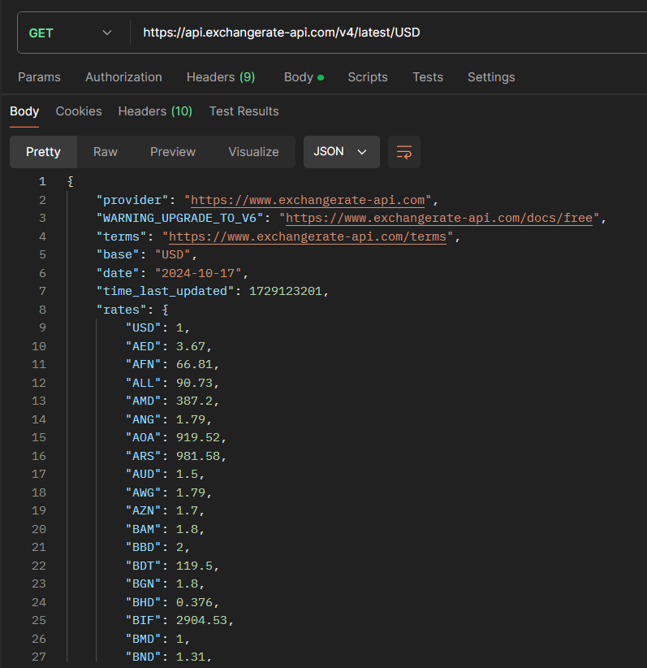

# Тестовое задание СЕНЛА от Никиты Мутовина

Краткое описание трех заданий.

## Содержание

- [Начало работы](#начало-работы)
- [Задания](#задания)
- [Особенности](#особенности)
- [Описание файлов](#описание-файлов)

## Начало работы

Эти инструкции помогут вам получить копию проекта на вашем локальном компьютере для разработки и тестирования.

Склонировать проект можно с помощью команды:

```bash
git clone https://github.com/nUc1eaAr-gampRUS545/test_senla.git -b master
```

## Задания

Задания, описанные в тестовом задании для записи на курс "JAVA с 0":

1. **Игра «Виселица»**  
   Реализуй игру «Виселица», где игрок пытается угадать слово, вводя одну букву за раз. Если буква отсутствует в слове, то игрок теряет жизнь. Игра заканчивается, когда игрок угадывает слово или теряет все жизни. Слово для отгадывания выбирается случайно из списка слов-констант внутри программы. После каждой введенной буквы выводить в консоль загадываемое слово с пропусками букв и сообщение о том, сколько жизней осталось. Рисовать в консоли человечка на виселице как иллюстрацию количества жизней (как это обычно бывает в «Виселице») не обязательно, но будет приветствоваться.

2. **Курс валют**  
   Создай консольное приложение, которое запрашивает у пользователя сумму в одной валюте и конвертирует её в другие валюты по фиксированному количеству обменных курсов. Курсы обмена валюты задавать в виде чисел с плавающей точкой. Курсы можно задать внутри кода программы как константы или один раз запрашивать при запуске программы и потом использовать их в течение всей её работы. Пяти валют будет достаточно для реализации.

3. **Генератор паролей**  
   Напиши программу, которая генерирует случайный безопасный пароль длиной от 8 до 12 символов. Пароль должен содержать заглавные и строчные буквы, цифры и специальные символы. Предоставь пользователю возможность выбрать длину пароля.

## Особенности

Для реализации задания с курсом валют была взята открытая [API](https://api.exchangerate-api.com/v4/latest/USD) для получения курса около 100 валют. В конце хоста нужно указать интересующую вас валюту, и API выдаст коэффициенты отношения текущей валюты к другим валютам. Эти коэффициенты умножаются на заданное в консоли число, и тем самым мы получим настоящий конвертер валют с актуальными курсами.

#### Вывод API:


## Описание файлов

- Задание с виселицей находится по адресу: `src/Hangman.java`
- Задание с конвертером валют находится по адресу: `src/Converter.java`
- Задание с генератором паролей находится по адресу: `src/PasswordGenerator.java`
